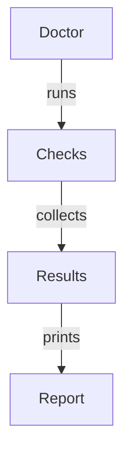

# Laravel Doctor Architecture

```
src/
├── Core/
├── Contracts/
├── Checks/
├── Repairs/
├── Reports/
├── Commands/
├── Support/
├── Console/
├── Exceptions/
└── Config/
```

## Core Design

Everything revolves around one object: **Doctor**.

`Doctor` doesn't run the checks itself; it only manages checks.



- **Doctor**: Manages checks registration and orchestrates the execution flow.
- **Checks**: Individual check modules (e.g., DatabaseCheck, AppKeyCheck).
- **Results**: `CheckResult` objects collected from each check.
- **Report**: The output generated by printing results through a `Reporter`.

## CheckResult Structure

Every check behaves identically and returns a standard `CheckResult` object to maintain consistency:

```
StorageCheck ──> returns ──> CheckResult
```

### Properties of `CheckResult`:
- `status`: The state of the check (e.g., `success`, `fail`, `warning`).
- `severity`: Importance level (e.g., `low`, `high`, `critical`).
- `message`: A brief description of what was checked or found.
- `recommendation`: A clear explanation of why it failed/warned and how to resolve it.
- `repairAvailable`: Boolean indicating if an automatic repair is supported.
- `repairCommand`: The CLI command or logic identifier to resolve the issue.

## Check Interface Design

Every check follows a strict contract. Mentally, the check and optional repair look like this:

```
check() ──> returns ──> CheckResult

Later (for Repairable Checks):
repair() ──> returns ──> Success/Failure Status
```

All health check modules implement the same system to remain pluggable.

## CLI Commands Design

The package exposes the following Artisan commands (listed, not yet implemented):

- `doctor`: The main interactive entry point that runs default checks.
- `doctor:scan`: Performs a full application diagnostics scan.
- `doctor:repair`: Attempts to repair common detected issues automatically.
- `doctor:production`: Validates the deployment state for a production environment.
- `doctor:performance`: Inspects and gives optimization suggestions for performance.
- `doctor:report`: Generates and exports files for diagnostics logs (HTML, Markdown, JSON).

